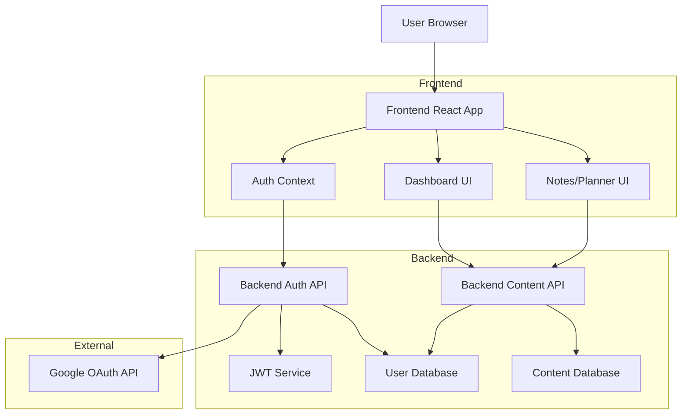

# Google OAuth Implementation Plan

This document outlines the detailed plan for implementing Google OAuth authentication and a user dashboard for ZuraBase.

## 1. Research and set up Google OAuth

First, we need to set up Google OAuth credentials and configure the application:

1. **Google OAuth Setup**:
   - Create a project in Google Cloud Console
   - Configure OAuth consent screen
   - Create OAuth 2.0 credentials (client ID and client secret)
   - Set up authorized redirect URIs for the application

2. **Required Scopes**:
   - `openid` - For basic authentication
   - `profile` - To access user's profile information
   - `email` - To get user's email address

## 2. Extend backend data models to support user accounts

We need to create new data models and update existing ones:

1. **User Model**:
```go
type User struct {
    ID            string    `json:"id" bson:"id"`
    Email         string    `json:"email" bson:"email"`
    Name          string    `json:"name" bson:"name"`
    Picture       string    `json:"picture" bson:"picture"`
    GoogleID      string    `json:"google_id" bson:"google_id"`
    LastLoginAt   time.Time `json:"last_login_at" bson:"last_login_at"`
    CreatedAt     time.Time `json:"created_at" bson:"created_at"`
    UpdatedAt     time.Time `json:"updated_at" bson:"updated_at"`
}
```

2. **Update Note Model**:
```go
type Note struct {
    ID        string    `json:"id" bson:"id"`
    UserID    string    `json:"user_id,omitempty" bson:"user_id,omitempty"`
    Text      string    `json:"text,omitempty" bson:"text"`
    Content   string    `json:"content,omitempty" bson:"content"`
    CoverURL  string    `json:"cover_url" bson:"cover_url"`
    CreatedAt time.Time `json:"created_at" bson:"created_at"`
    UpdatedAt time.Time `json:"updated_at" bson:"updated_at"`
}
```

3. **Update Planner Model**:
```go
type Planner struct {
    ID          string          `json:"id" bson:"id"`
    UserID      string          `json:"user_id,omitempty" bson:"user_id,omitempty"`
    Title       string          `json:"title" bson:"title"`
    Description string          `json:"description" bson:"description"`
    TemplateID  string          `json:"template_id" bson:"template_id"`
    CreatedAt   time.Time       `json:"created_at" bson:"created_at"`
    UpdatedAt   time.Time       `json:"updated_at" bson:"updated_at"`
    Lanes       []PlannerLane   `json:"lanes" bson:"lanes"`
    Columns     []PlannerColumn `json:"columns" bson:"columns"`
}
```

## 3. Implement backend authentication endpoints

Create new endpoints for authentication and user management:

1. **Authentication Endpoints**:
   - `GET /auth/google` - Initiates Google OAuth flow
   - `GET /auth/google/callback` - Handles OAuth callback
   - `GET /auth/user` - Returns current user info
   - `POST /auth/logout` - Logs out the user

2. **Session Management**:
   - Implement JWT token generation and validation
   - Create middleware for protected routes
   - Set up secure cookie handling for session management

## 4. Create frontend authentication components

Develop UI components for authentication:

1. **Authentication Components**:
   - Login button component
   - User profile dropdown component
   - Protected route component

2. **Authentication Context**:
   - Create React context for authentication state
   - Implement hooks for accessing user data and authentication state
   - Add token refresh mechanism

## 5. Implement user-content association in backend

Update backend logic to associate content with users:

1. **Content Association**:
   - Update note and planner handlers to associate new content with authenticated users
   - Modify retrieval functions to filter by user ID when authenticated
   - Maintain public access for shared content

2. **User Content Queries**:
   - Create endpoints to fetch user's notes and planners
   - Implement sorting and filtering options (recent, shared)

## 6. Create dashboard UI for authenticated users

Design and implement the dashboard:

1. **Dashboard Layout**:
```jsx
<DashboardLayout>
  <Header />
  <Sidebar />
  <MainContent>
    <RecentItems />
    <MyNotes />
    <MyPlanners />
    <SharedWithMe />
  </MainContent>
</DashboardLayout>
```

2. **Dashboard Components**:
   - Recent items section
   - My Notes section with grid/list view
   - My Planners section with grid/list view
   - Shared items section
   - Search and filter functionality

## 7. Implement "import" functionality for anonymous content

Add ability to import anonymous content:

1. **Import Functionality**:
   - Add "Import" button to anonymous content
   - Create backend endpoint for importing content
   - Implement copy logic that associates content with user

2. **UI Components**:
   - Import confirmation modal
   - Success/error notifications

## 8. Update existing components to handle authentication state

Modify existing components to be authentication-aware:

1. **Component Updates**:
   - Update NavBar to show login/profile based on auth state
   - Modify NotesApp and PlannerApp to handle user context
   - Update sharing functionality to show owner information

2. **Conditional Rendering**:
   - Show different UI elements based on authentication state
   - Add user-specific actions when authenticated

## 9. Add user profile and settings functionality

Implement user profile management:

1. **Profile Management**:
   - Create profile page
   - Add settings for default preferences
   - Implement account linking options

2. **User Settings**:
   - Default view options
   - Notification preferences
   - Theme settings

## 10. Test and refine the implementation

Comprehensive testing and refinement:

1. **Testing Strategy**:
   - Unit tests for authentication logic
   - Integration tests for user-content association
   - End-to-end tests for authentication flow
   - User acceptance testing

2. **Refinement Areas**:
   - Performance optimization
   - Security hardening
   - UX improvements
   - Error handling and recovery

## Architecture Diagram

Here's a high-level architecture diagram for the Google OAuth implementation:



## Data Flow Diagram

Here's a data flow diagram for the authentication process:

```mermaid
sequenceDiagram
    participant User
    participant Frontend
    participant Backend
    participant Google
    participant Database
    
    User->>Frontend: Click Login
    Frontend->>Backend: Initiate OAuth
    Backend->>Google: Redirect to OAuth
    Google->>User: Show consent screen
    User->>Google: Grant permission
    Google->>Backend: OAuth callback with code
    Backend->>Google: Exchange code for token
    Google->>Backend: Return access token
    Backend->>Backend: Create JWT token
    Backend->>Database: Create/update user
    Backend->>Frontend: Return JWT and user info
    Frontend->>Frontend: Store JWT in localStorage
    Frontend->>User: Show authenticated UI
