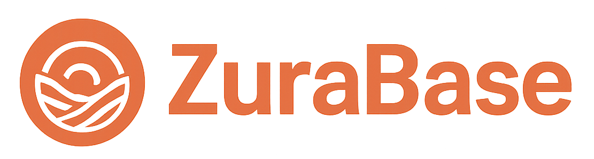

<div id="top">

<!-- HEADER STYLE: COMPACT -->


---

<!-- BADGES -->


<em>Built with these tools and technologies:</em>


<br>


## Overview

This repository hosts a modular monolith application with two main features: a markdown notes app and a planner board system, both built with a Go backend and a Node.js (React/TypeScript) frontend. The application allows users to create, edit, and share both markdown notes and interactive planning boards.


The backend uses MongoDB to store notes and planner data, with a comprehensive API for both features.

## Features

### Markdown Notes
- **Markdown Support**: The application supports markdown editing, allowing users to format their notes with ease.
- **Image Handling**: Users can include images in their notes, enhancing the visual aspect of their content.
- **Sharing Capabilities**: Notes can be shared with others, promoting collaboration. No account creation needed to create, view and share notes.

### Planner Boards
- **Kanban and Scrum Templates**: Create planning boards with predefined templates for Kanban or Scrum methodologies.
- **Customizable Lanes**: Create, reorder, and color-code lanes to organize your tasks.
- **Card Management**: Add cards to lanes with customizable fields, move cards between lanes, and reorder them.
- **Split Lane Functionality**: Split existing lanes to create new organizational structures.
- **Markdown Export**: Export your planner board as a structured markdown document.
- **Drag and Drop Interface**: Intuitive drag-and-drop interface for moving cards and lanes.
- **Real-time Updates**: Changes are automatically saved as you work.

### Strands
- **Content Capture**: Save and organize pieces of information as "strands"
- **AI Enrichment**: Automatic tagging and summarization of content using AI
- **Per-Strand Sync**: Manually trigger AI enrichment for individual strands
- **Sync History**: Track all sync operations with timestamps, summaries, and tags
- **Version Rollback**: Restore strands to previous sync states
- **Resilient Saving**: Strands are always saved to the database, even when AI services are unavailable
- **Asynchronous Processing**: Background processing for AI enrichment without blocking user interactions
- **Tag Management**: Add, remove, and filter content by tags
- **Related Content**: Discover connections between strands based on shared tags

### LangGraph & AI Workflow

ZuraBase now integrates **LangGraph-based AI workflows** inspired by the [FreeCodeCamp LangChain/LangGraph guide](https://www.freecodecamp.org/news/how-to-use-langchain-and-langgraph-a-beginners-guide-to-ai-workflows/).

#### 🧠 Key Improvements
- **Graph-Oriented Orchestration:** replaces linear HTTP AI calls with modular graph workflows
- **Metadata-Aware Analysis:** user and LLM profile context influence results
- **Structured Responses:** standardized JSON output schema improves reliability
- **Observability:** enables step-level tracing and debugging
- **Hybrid Mode:** backward-compatible fallback to legacy LangChain clients

LangGraph allows multi-node AI pipelines where tasks like summarization, tagging,
and related content discovery operate as discrete graph nodes with traceable
connections and structured outputs.

Example architecture:
```
┌──────────────────────────────┐
│     LangGraph Workflow       │
├──────────────────────────────┤
│ Prompt Builder  →  Analyzer  │
│ Context Provider →  Parser   │
└──────────────────────────────┘
```

The backend now communicates with a local or remote LangGraph service at
`http://localhost:8000/api/v1/langgraph/run`, sending structured workflow
requests with optional trace and telemetry support.

---

## LangGraph Workflow Overview

The ZuraBase backend now uses LangGraph to manage structured AI workflows through JSON graph execution calls.

**Endpoint:** `POST /api/v1/langgraph/run`

**Example Request**
```json
{
  "workflow": "content_analysis_graph",
  "inputs": {
    "content": "Example strand content",
    "source": "manual",
    "metadata": {
      "user_id": "123",
      "profile_id": "p123"
    }
  },
  "options": {
    "trace": true,
    "return_schema": true
  }
}
```

**Features**
- Modular nodes (`PromptBuilder`, `ContextInjector`, `ModelExecutor`, `OutputParser`, `Normalizer`)
- Resilient node-level error isolation
- Traceable execution with telemetry
- Compatible with both LangChain and LangGraph services

**Run locally**
```bash
docker run -d -p 8000:8000 langgraph-service:latest
export LLM_CLIENT_MODE=langchain
```

---

## Getting Started

### Prerequisites

This project requires the following dependencies:

- **Programming Language:** TypeScript, Go
- **Package Manager:** NPM, Go
- **Secrets Manager:** Doppler
- **Container Runtime:** Docker
- **Database:** MongoDB
- **Testing:** Pre-commit, Devbox

## Developing locally

You can run the api and ui together using `docker-compose`:

```bash
make up
```

The backend API will be available at [http://localhost:8080/](http://localhost:8080/) and the frontend at [http://localhost:8181/](http://localhost:8181/).

## Testing

Like in CI, we'll utilize devbox to perform tests in an isolated env:

```bash
# Test Frontend
devbox run test_fe

# Test Backend
devbox run test_be

```

## LangGraph Workflow Implementation

ZuraBase leverages the **LangGraph-derived AI workflow layer** to process strand enrichment asynchronously.

**Key Benefits**
- Modular and reusable graph workflow definitions for AI enrichment tasks.
- Support for parallel node execution (tag analysis, summarization, relation detection).
- Compatibility with future LangChain Expression Language (LCEL) upgrades.

**Service Endpoint**

The backend sends structured POST requests to:

```bash
http://localhost:8000/api/v1/langgraph/run
```

**Example Workflow Payload**
```json
{
  "workflow": "content_analysis_graph",
  "inputs": {
    "content": "Example strand content about open-source",
    "source": "manual",
    "metadata": {
      "user_id": "12345",
      "profile_id": "p123"
    }
  },
  "options": {
    "trace": true,
    "return_schema": true
  }
}
```

The workflow executes a chain:
```
PromptBuilder → ContextInjector → ModelExecutor → OutputParser → Normalizer
```

Each node produces typed outputs validated via schema checking. Telemetry data allows AI interaction visibility.

---

## API Endpoints

### Notes API

| Method | Endpoint         | Description                                                              |
| ------ | ---------------- | ------------------------------------------------------------------------ |
| GET    | `/note/:id`      | Retrieve a note by ID                                                    |
| POST   | `/note`          | Create a new note (or update an existing one)                            |
| GET    | `/images/:query` | Search for images by using the [Pexels API](https://www.pexels.com/api/) |

### Planner API

| Method | Endpoint                                  | Description                                    |
| ------ | ----------------------------------------- | ---------------------------------------------- |
| POST   | `/planner`                                | Create a new planner board                     |
| GET    | `/planner/:id`                            | Retrieve a planner board by ID                 |
| PUT    | `/planner/:id`                            | Update a planner board's title and description |
| DELETE | `/planner/:id`                            | Delete a planner board                         |
| GET    | `/planner/templates`                      | Get available planner templates                |
| GET    | `/planner/:id/export`                     | Export a planner as markdown                   |
| POST   | `/planner/import`                         | Import a planner from markdown                 |
| POST   | `/planner/:id/lane`                       | Add a new lane to a planner                    |
| PUT    | `/planner/:id/lane/:laneId`               | Update a lane                                  |
| DELETE | `/planner/:id/lane/:laneId`               | Delete a lane                                  |
| POST   | `/planner/:id/lane/:laneId/split`         | Split a lane into two                          |
| POST   | `/planner/:id/lane/:laneId/card`          | Add a card to a lane                           |
| PUT    | `/planner/:id/lane/:laneId/card/:cardId`  | Update a card                                  |
| DELETE | `/planner/:id/lane/:laneId/card/:cardId`  | Delete a card                                  |
| POST   | `/planner/:id/card/:cardId/move`          | Move a card to a different lane                |
| POST   | `/planner/:id/lanes/reorder`              | Reorder lanes                                  |
| POST   | `/planner/:id/lane/:laneId/cards/reorder` | Reorder cards in a lane                        |

### Strands API

| Method | Endpoint            | Description                                      |
| ------ | ------------------- | ------------------------------------------------ |
| GET    | `/strands`          | Retrieve all strands with optional tag filtering |
| GET    | `/strands/:id`      | Retrieve a strand by ID                          |
| POST   | `/strands`          | Create a new strand                              |
| PUT    | `/strands/:id`      | Update an existing strand                        |
| DELETE | `/strands/:id`      | Delete a strand                                  |
| GET    | `/strands/tags`     | Get all tags used across strands                 |
| POST   | `/strands/:id/sync` | Sync a specific strand with AI                   |
| POST   | `/strands/sync`     | Manually trigger AI enrichment for all strands   |

## Contributing
- **🐛 [Report Issues](https://github.com/jomakori/zurabase/issues)**: Submit bugs found or log feature requests for the `zurabase` project.
- **💡 [Submit Pull Requests](https://github.com/jomakori/zurabase/pulls)**: Review open PRs, and submit your own PRs.

### Contributing Guidelines
<details>
<summary>More info</summary>

1. **Clone the Repository**: Start by cloning the repo
   ```sh
   git clone https://github.com/jomakori/zurabase
   ```
2. **Create a New Branch**: Always work on a new branch, giving it a descriptive name.
   ```sh
   git checkout -b <initials>/<new-feature-x>
   ```
3. **Make Your Changes**: Develop and test your changes locally.
4. **Commit/Push Your Changes**: make continuous commits of your changes to your branch
   ```sh
   git commit -m 'feat(category): <insert commit message>'
   git push origin <initials>/<new-feature-x>
   ```
5. **Submit a `WIP` Pull Request and point it to `staging`**: Fill out the template and make sure its pointing to `staging`
   ```sh
   git commit -m 'feat(category): <insert commit message>'
   gh pr create --base staging --head <your-branch-name>
   ```
6. **Test/Deploy to Staging**:
   - Once the PR has been reviewed and approved - merge into `staging` to trigger testing
   - When tests pass - changes are deployed to `staging`
   - The `Release` PR is auto-generated - w/ the same content as the `WIP` PR
7. **Release changes to PROD:**
   - Confirm changes on `staging`
   - If changes look good - merge the `Release` PR to `main` - which will deploy changes to `Production`
</details>

### Contributors
<br>
<p align="left">
   <a href="https://github.com{/jomakori/zurabase/}graphs/contributors">
      
   </a>
</p>

